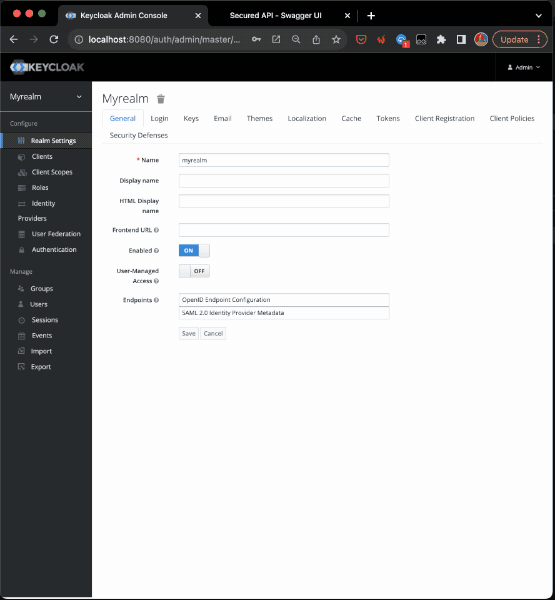

# Secure API with OAuth2

This sample API implements OAuth2 with the `Resource Owner Password Credentials Grant` OR `Client Credentials Grant`.

With the [ROPC grant type](https://datatracker.ietf.org/doc/html/rfc6749#section-4.3), the app asks the end-user for a username and password once, and then uses the credentials to request an access token from the Authorization Server (Keycloak). In turn, the app uses the token to access the end-user data or perform actions on behalf of the end-user (without asking for a password again and again).

With the [CC grant type](https://datatracker.ietf.org/doc/html/rfc6749#section-4.4), the app authenticates itself to the Authorization Server (Keycloak) without involving any specific user and receives an access token with its own set of claims (as configured by the Authorization Server). The application or client that requests the token performs actions on the API on its own behalf.

Some API endpoints may require different levels of Authentication and/or Authorization.

For example:

- the user is authenticated (i.e. has a valid token, that is: the token signature is verified against the Realm's public key downloaded from Keycloak): see `GET /api/v1/secured/valid_user`
- the user has a specific role (i.e. the token has a predefined value in the `role` array): see `GET /api/v1/secured/role`
- the user has a specific custom claim with any value (i.e. the token has a specific claim `type`): see `GET /api/v1/secured/claim`
- the user has a specific custom permission (i.e. the token has a specific `type:value`): see `GET /api/v1/secured/claim_value`
- the user has multiple specific custom permissions (i.e. the token has a specific `type1:value1` AND `type2:value2`): see `GET /api/v1/secured/claims_values`



## Usage

1. Install/Start Docker Desktop
2. Clone the repo and open it with VScode
3. Select "`Python: Remote Attach`" action from the Run and Debug menu
4. Run `docker-compose.debug.yml` with vscode (Right click > `Compose Up`)
5. Attach to the app to start it (keyb `F5`)
6. Navigate to http://localhost:8080
7. Navigate to http://localhost:8893
8. Try any endpoint and see the 401 Unauthorized for restricted endpoints
9. Authenticate/Authorize with `test@test.com:test` (cf. green `Authorize` button in SwaggerUI top-right)
10. Try again a protected endpoint
11. TADAA
12. To enable `grant_type: client_credentials`, just set the `oauth2_scheme` to `Oauth2ClientCredentials` (see `app.py:91`)! Obviously some endpoints wont authorize the client if the claims arent included in the token! :)

## Realm Config

Keycloak is configured with a sample Realm that includes a client configuration for the ``

See [realm-config.json](realm-config.json)!

Name: `myrealm`

### Client `secureapi`

```json
{
   "clientId": "secureapi",
   "secret": "380577f5-3262-4a05-a84c-9e98cc276f85",
   "redirectUris": [
       "*"
   ],
   "directAccessGrantsEnabled": true,
   "webOrigins": [
       "*"
   ],
   "defaultClientScopes": [
       "web-origins",
       "profile",
       "roles",
       "api",
       "email"
   ]
}
```

### Client Scope `api`

The `api` client scope adds to the token:

- the `audience: api` (which is required by the api, see `validate_token()` and `settings.expected_audience`)
- the `Realm Role` as the `role` claim
- the user attribute `custom_claim` as the `custom_claim` claiim
- the name, username, email from the user profile

```json
{
   "name": "api",
   "description": "Expected scope for secureapi test app",
   "protocol": "openid-connect",
   "attributes": {
       "include.in.token.scope": "true"
   },
   "protocolMappers": [
       {
           "name": "api audience",
           "protocol": "openid-connect",
           "protocolMapper": "oidc-audience-mapper",
           "consentRequired": false,
           "config": {
               "id.token.claim": "true",
               "access.token.claim": "true",
               "included.custom.audience": "api"
           }
       },
       {
           "name": "User Realm Role",
           "protocol": "openid-connect",
           "protocolMapper": "oidc-usermodel-realm-role-mapper",
           "consentRequired": false,
           "config": {
               "multivalued": "true",
               "userinfo.token.claim": "true",
               "id.token.claim": "true",
               "access.token.claim": "true",
               "claim.name": "role",
               "jsonType.label": "String"
           }
       },
       {
           "name": "custom_claim",
           "protocol": "openid-connect",
           "protocolMapper": "oidc-usermodel-attribute-mapper",
           "consentRequired": false,
           "config": {
               "aggregate.attrs": "true",
               "multivalued": "true",
               "userinfo.token.claim": "true",
               "user.attribute": "custom_claim",
               "id.token.claim": "true",
               "access.token.claim": "true",
               "claim.name": "custom_claim",
               "jsonType.label": "String"
           }
       },
       {
           "name": "full name",
           "protocol": "openid-connect",
           "protocolMapper": "oidc-full-name-mapper",
           "consentRequired": false,
           "config": {
               "id.token.claim": "true",
               "access.token.claim": "true",
               "userinfo.token.claim": "true"
           }
       },
       {
           "name": "username",
           "protocol": "openid-connect",
           "protocolMapper": "oidc-usermodel-property-mapper",
           "consentRequired": false,
           "config": {
               "userinfo.token.claim": "true",
               "user.attribute": "username",
               "id.token.claim": "true",
               "access.token.claim": "true",
               "claim.name": "preferred_username",
               "jsonType.label": "String"
           }
       },
       {
           "name": "email",
           "protocol": "openid-connect",
           "protocolMapper": "oidc-usermodel-property-mapper",
           "consentRequired": false,
           "config": {
               "userinfo.token.claim": "true",
               "user.attribute": "email",
               "id.token.claim": "true",
               "access.token.claim": "true",
               "claim.name": "email",
               "jsonType.label": "String"
           }
       },
       {
           "name": "profile",
           "protocol": "openid-connect",
           "protocolMapper": "oidc-usermodel-attribute-mapper",
           "consentRequired": false,
           "config": {
               "userinfo.token.claim": "true",
               "user.attribute": "profile",
               "id.token.claim": "true",
               "access.token.claim": "true",
               "claim.name": "profile",
               "jsonType.label": "String"
           }
       }
   ]
}

```

## Role `tester`

This is a custom role with nothing special attached to it.

```json
"roles": {
    "realm": [
        {
            "id": "7cba7a84-6770-4ca3-908d-20422d781504",
            "name": "tester",
            "composite": false,
            "clientRole": false,
            "containerId": "9f3e820a-588d-479a-a16a-97e8bd90e228",
            "attributes": {}
        }
    ]
}
```

## Group `testgroup`

This group adds the `custom_claim: my_claim_value` claim and the RealmRole `tester` to the token generated for its members.

```json
"groups": [
    {
        "name": "testgroup",
        "path": "/testgroup",
        "attributes": {
            "custom_claim": [
                "my_claim_value"
            ]
        },
        "realmRoles": [
            "tester"
        ]
    }
],
```

## User `test@test.com:test`

The user is member of the `testgroup` group, and therefore inherits the `role: tester` and `custom_claim: my_claim_value` claims in its tokens.

```json
"users": [
    {
        "username": "test",
        "enabled": true,
        "emailVerified": true,
        "firstName": "John",
        "lastName": "Doe",
        "email": "test@test.com",
        "credentials": [
            {
                "type": "password",
                "value": "test",
                "temporary": false
            }
        ],
        "groups": [
            "testgroup"
        ]
    }
]
```
